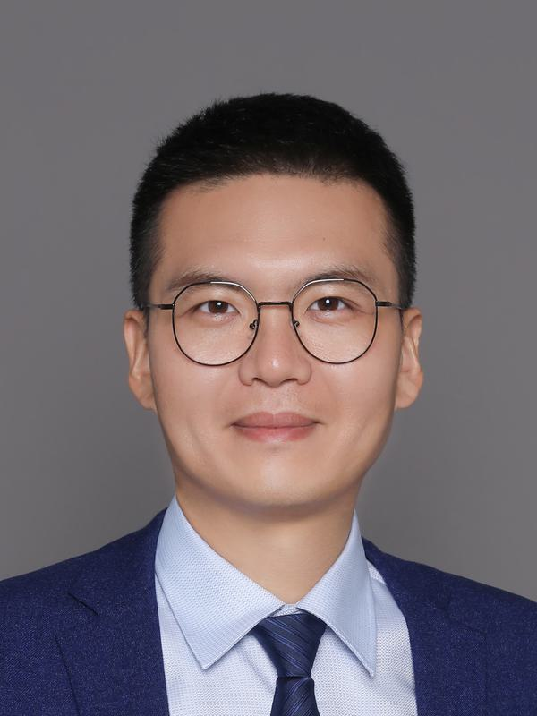
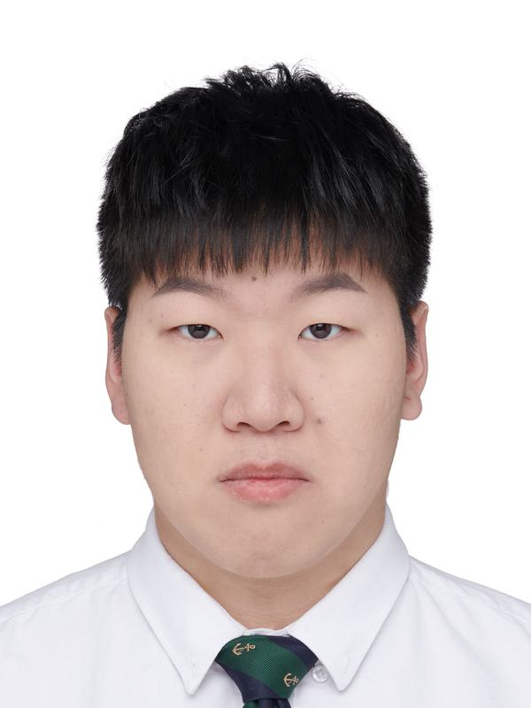
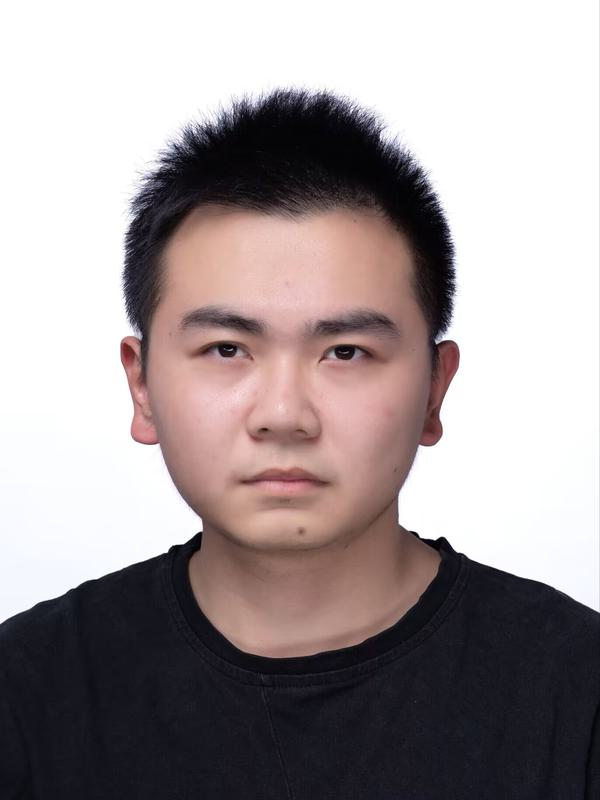
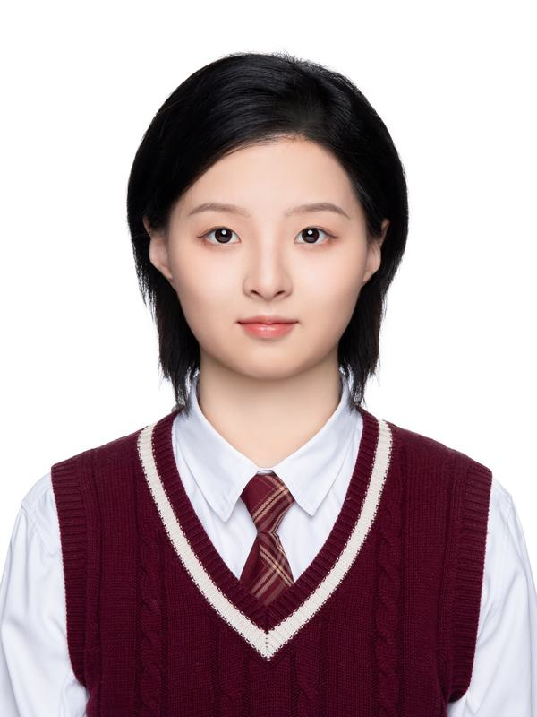
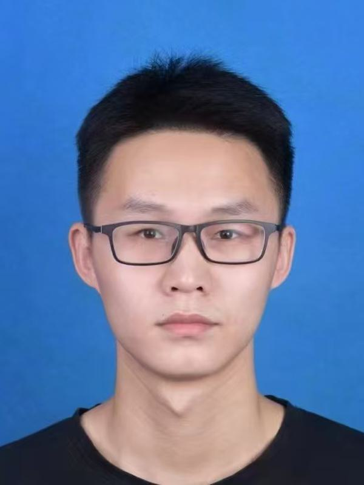
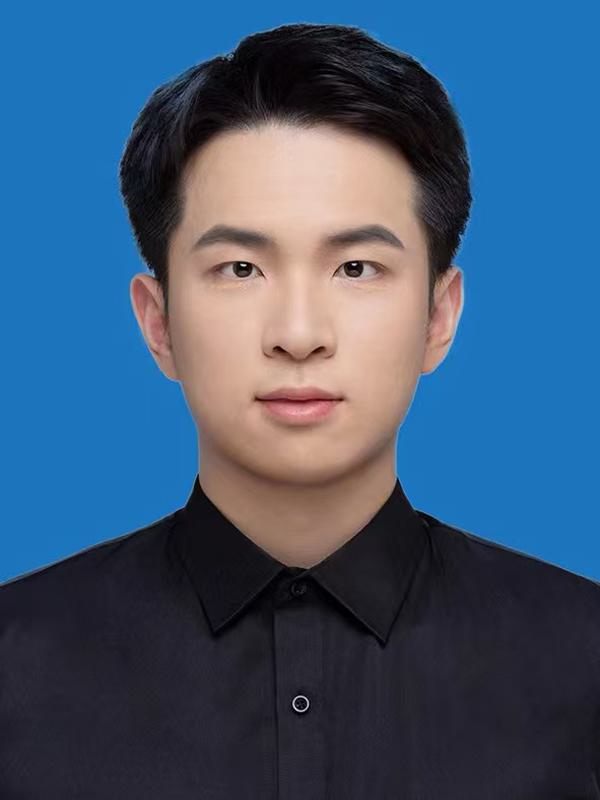
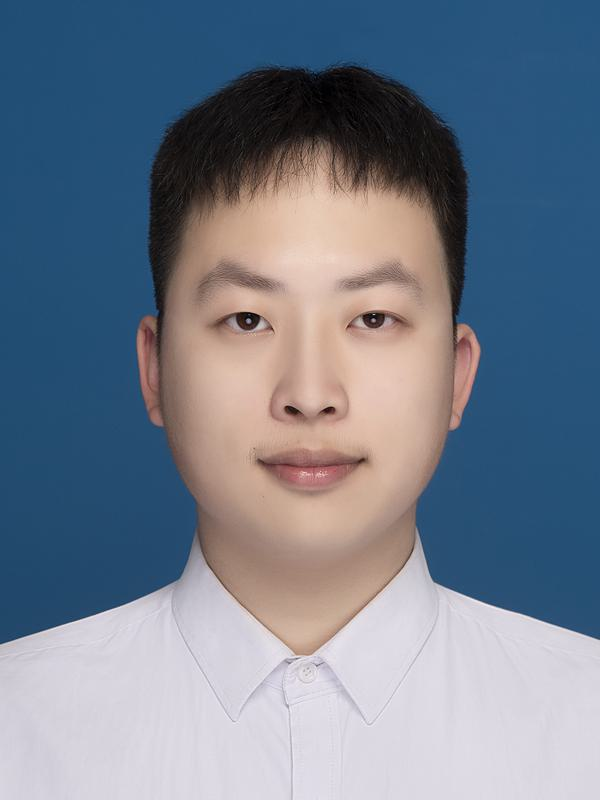

# 🌟 团队成员介绍 🌟

## 💼 指导老师

### 🌈 乔通 副教授

  

- 🧪 **研究方向**：人工智能安全、多媒体取证、信息隐藏与分析等  
- 📧 **联系方式**：tong.qiao@hdu.edu.cn  
- 🌐 **GitHub主页**：[https://q-bigbig.github.io/](https://q-bigbig.github.io/)  

#### 📖 个人简介

乔通，副教授，硕士生导师，**浙江-法国数字媒体取证联合实验室（省级平台）负责人**，国际期刊 *IET Image Processing* 编委，*EURASIP Journal on Information Security* 编委，《网络空间安全科学学报》青年编委。

他于2009年在信息工程大学获得电子信息工程专业学士学位，2012年在上海大学获得通信与信息系统专业硕士学位。同年获国家留学基金UT-INSA专项资助，公派留学法国特鲁瓦技术大学（University of Technology of Troyes）LM2S实验室，于2016年获得系统优化与可靠性专业博士学位。

2016年加入杭州电子科技大学网络空间安全学院。现为中国图象图形学学会数字媒体取证与安全专委会委员、中国中文信息学会大数据与隐私计算专委会委员。

主持国家级项目2项、省部级项目3项，发表高水平论文70余篇。曾获：
- 河南省自然科学一等奖（信息隐藏的基础理论与方法）  
- 浙江省高校领军人才培养计划（青年优秀人才）  
- 杭电第十二届青年教师教学技能大赛“优胜奖”  
- 杭电第一届教师教学创新大赛“二等奖”  
- “星耀杭电”第二届“科研之星”  

---

## 🌱 在研学生介绍

### 🎓 2023级硕士研究生

#### 🌼 李壮

  

- 🎯 兴趣爱好：骑行  
- 🎓 教育背景：  
  - 2019–2023 杭州电子科技大学  
  - 2023–至今 杭州电子科技大学  

---

#### 🌼 胡杰

  

- 🎯 兴趣爱好：篮球、足球比赛  
- 🎓 教育背景：  
  - 2019–2023 杭州电子科技大学  
  - 2023–至今 杭州电子科技大学  

---

#### 🌼 姚毅铭

  

- 🎯 兴趣爱好：躺平  
- 🎓 教育背景：  
  - 2019–2023 浙大城市学院  
  - 2023–至今 杭州电子科技大学  

---

### 🎓 2024级硕士研究生

#### 🌼 陈章绮

  

- 🎯 兴趣爱好：篮球  
- 🎓 教育背景：  
  - 2019–2023 河南大学  
  - 2024.9–至今 杭州电子科技大学  

---

#### 🌼 夏昀

  

- 🎯 兴趣爱好：游泳  
- 🎓 教育背景：  
  - 2019–2023 杭州电子科技大学  
  - 2024.9–至今 杭州电子科技大学  

---

#### 🌼 胡泽科

  

- 🎯 兴趣爱好：羽毛球  
- 🎓 教育背景：  
  - 2020–2024 温州大学  
  - 2024.9–至今 杭州电子科技大学  

---

## 🎓 往届毕业生

### 📅 2022届
- 石沧海  
- 毛梁杰（中国电信）  
- 陆晨旭（华为）  
- 朱振鑫（柏楚电子）  

### 📅 2021届
- 牛犇（中国电信）  
- 邵杭  
- 乔明磊（中国电信）  
- 赵彬（海康威视）  
- 许升望（浙江大学，读博）  

### 📅 2020届
- 谢世闯（上海大学，读博）  
- 陈彧星（加特兰微电子科技（上海）有限公司）  
- 吴佳晟（美团）  
- 王劭祥（字节跳动）  
- 马鱼雁（浙江能源集团）  

### 📅 2019届
- 武晓帅（湖南大学，读博）  
- 夏志明（华为）  
- 余阳鑫  
- 张俐  

### 📅 2018届
- 杜宇庭（字节跳动）  
- 吴超豪（大华）  
- 潘彬民（阿里巴巴）  

### 📅 2017届
- 姚宏伟（浙江大学，读博）  
- 王亚茹（百世技术）  
- 柳权琪（百度）  
- 祝智强（华为）  

### 📅 2016届
- 黄明瑛（华为）  
- 燕飞鹏（同花顺）  
- 赵宜花（中国移动）  
- 陈琳（浙江大学，读硕）  

---

🎉 **感谢大家加入我们的团队，期待与你们共创美好未来！** 🌟
