# 🛡️ Anti-Fake AI 产品介绍

> 面向多模态内容伪造检测的全流程解决方案  
> 为安全审查、内容监管、司法取证提供强有力的技术支撑

---

## 🔍 什么是 Anti-Fake AI？

**Anti-Fake AI** 是一款面向图像、视频、音频等多模态内容的**AIGC伪造检测平台**，可自动识别并判断内容是否由主流生成式AI模型（如秒画、文心一格、Midjourney、Runway等）合成。

平台具备以下核心能力：

- 🎯 **高准确率检测**：基于多监督训练 + 鲁棒特征提取，检测精度行业领先  
- ⚡ **低时延响应**：端到端优化设计，检测响应最快可达 20ms  
- 🔎 **内容指纹溯源**：支持AI模型溯源识别、版本识别、伪造局部定位  
- 🧠 **多模态融合**：统一检测图像 / 视频 / 音频 / 文本内容  
- 🔐 **隐私与合规保障**：支持本地私有化部署，满足政企合规要求

---

---

## 🔒 大模型安全测评支持

平台不仅聚焦 AIGC 伪造内容检测，还提供 **大模型安全测评** 功能，全面评估大模型在实际应用中的安全性与合规性表现：

- 🧩 **越狱与诱导防护测试**：自动化评估模型对提示注入、越权请求、诱导攻击等的响应情况  
- 🕵️ **内容合规性审查**：审查模型输出是否存在政治、色情、暴力、歧视等不良生成  
- 🧠 **语义偏差检测**：评估模型是否存在价值观偏离、虚假陈述或伦理风险  
- 🔁 **持续对话鲁棒性评估**：检测多轮对话中模型的一致性、上下文理解与信息记忆能力  
- 🔐 **隐私保护能力评估**：测试模型对敏感信息（如身份证号、手机号等）提取与记忆能力，识别潜在泄露风险

测评结果可输出详尽报告，支持 **政企合规审查、模型选型评估、安全能力评级** 等多种场景使用。

---

## 🧭 应用场景

| **应用场景**             |                **描述**                                                                                                                                         |
|:--------------------------:|:--------------------------------------------------------------------------------------------------------------------------------------------------:|
| **社交媒体内容审核**     | 内容平台可通过本平台对**多模态生成内容**（文本、图像、音视频等）进行**自动化审核与敏感风险识别**，重点识别**虚假信息、涉政涉黄内容及价值观偏离表达**。       |
| **教育智能全链监管**         | 教育机构可借助平台对用于**教学辅助、考试命题、学术研究**等场景的大模型进行**内容可信性检测与安全评估**，防止**错误知识传播、诱导性回答及学术诚信**等问题。 |
| **金融领域合规管理**         | 银行、证券等金融机构可基于平台对**投研分析、客户服务等模型应用**进行**敏感信息过滤与输出审查**，防范**虚假财经信息生成、内幕信息泄露及投资误导风险**。     |
| **国家公共安全监管**     | 公安、网信等**政府机构**可借助该平台对**大模型**进行**全流程安全评估与常态化监测**，及时发现**数据泄露、对抗攻击、越狱风险**等问题，提升模型整体防护能力。 |
| **智慧政务内容保护**     | 各级政务系统可基于平台对**政策解读、政务问答**等大模型进行**价值观校正与输入内容过滤**，确保输出内容**合规可信**，防范**误导性生成或越权响应**。         |
| **智能交通安全护航**     | 平台可为**交通调度与导航**大模型提供**安全评估与持续监测**，及时发现**模型偏差、路径误导或攻击风险**，保障交通系统指令的**精准性与可靠性**。           |
| **司法取证安全审查**     | **法院、检察院等司法机构**可利用平台对**案件分析类模型**进行**安全验证**，确保模型生成的分析报告和推理建议**符合法律逻辑**，避免**信息注入与篡改攻击**。     |

---

## 🌐 支持模型类型

平台当前已支持检测以下 **四大模态** 的 AIGC 内容生成与伪造，点击跳转至详情页面：

### 🖼️ 图像生成  
详见：[图像生成模型总览](../support/overview.md)

### 📝 文本生成  
详见：[文本生成模型总览](../support/text/overview.md)

### 🎧 音频生成  
详见：[音频生成模型总览](../support/audio/overview.md)

### 🎬 视频生成  
详见：[视频生成模型总览](../support/video/overview.md)

**支持模型数量：150+**

---

平台已覆盖主流 AIGC 内容的生成与伪造检测，始终保持对新模型快速接入的能力，为商业与安全提供可靠保障。

---

## 📊 产品功能对比表

| 功能项        | Free Plan       | Medium Plan     | Pro Plan        |
| :-----------: | :-------------: | :-------------: | :-------------: |
| 支持模型数    | 92              | 120             | 150+            |
| 检测时延      | 120ms           | 80ms            | 20ms            |
| 图像检测      | ✅               | ✅               | ✅               |
| 视频检测      | ❌              | ✅               | ✅               |
| 音频检测      | ❌              | ❌              | ✅               |
| 多语言支持    | 简体中文        | 中英双语        | 多语种（含API）  |
| 本地私有部署  | ❌              | ✅               | ✅               |
| 模型溯源分析  | ❌              | ✅               | ✅（支持版本识别） |
| 高并发处理    | ❌              | 最高 200 QPS    | 无限扩展        |
| 技术支持      | 社区支持        | 工作日响应      | 专属客服+定制对接 |

---

## 🏆 为什么选择 Anti-Fake AI？

- **权威认可**  
  产品荣获多项行业顶级AI安全赛事大奖：  
  - 2024年全国人工智能应用场景创新挑战赛全国总决赛特等奖  
  - 2024年全国人工智能应用场景创新挑战赛智能网专项赛特等奖  
  
  同时，产品被纳入杭州公安局联合成立的深度伪造检测实验室，并已进入绍兴市公安局采购目录，获得多地公安机关及网信办的高度认可。

- **泛化能力强**  
  面对未知模型伪造内容，依旧具备出色的识别能力。

- **可持续更新**  
  模型库与检测算法持续升级，紧跟最新AIGC技术发展。

- **可定制服务**  
  支持政企客户定制检测策略、UI界面和API接口格式。

---

## 🧪 实验室与平台

  

    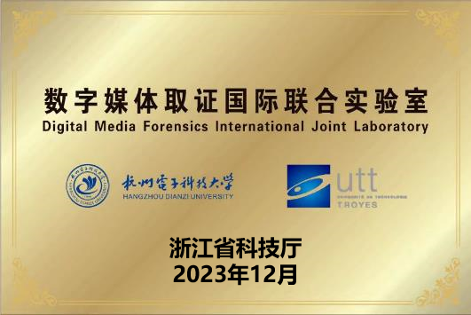
    

      <h3 style="font-size: 1.1rem; line-height: 1.3rem; margin: 0;">浙江-法国数字媒体取证国际联合实验室</h3>
    

    
成立于2023年，专注于AIGC伪造检测技术的研发与应用。

  

  

    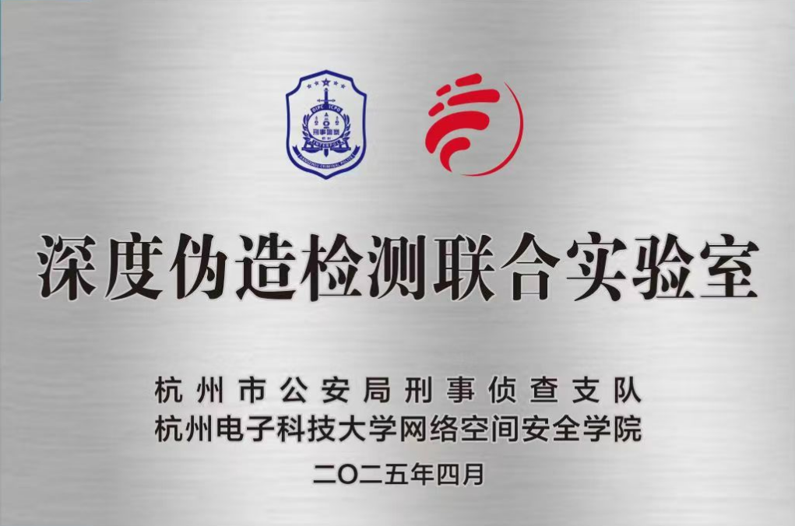
    

      <h3 style="font-size: 1.1rem; line-height: 1.3rem; margin: 0;">深度伪造检测实验室</h3>
    

    
2025年与杭州市公安局刑事科学技术研究所联合成立，聚焦前沿伪造内容识别与司法取证技术。

  

---
## 🤝 合作伙伴

  

    

      
    

    
<strong>杭州市公安局</strong>

  

  

    

      
    

    
<strong>绍兴市公安局</strong>

  

---

## 🏅 荣誉与奖项

  

    

      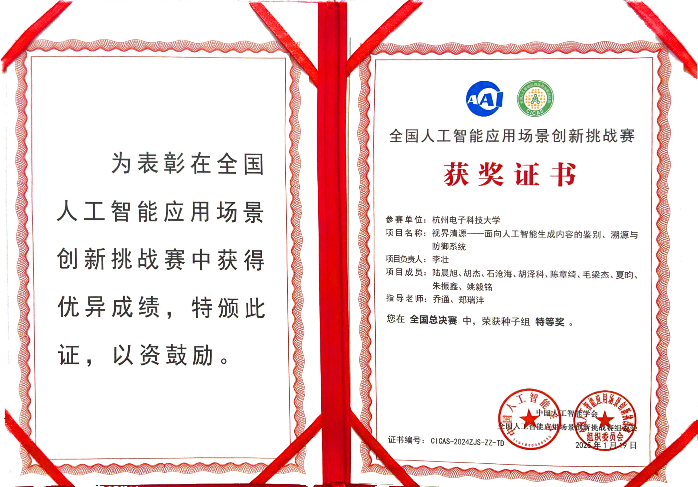
    

    
<strong>2024年 全国人工智能应用场景创新挑战赛 全国总决赛特等奖</strong>

  

  

    

      
    

    
<strong>2024年 全国人工智能应用场景创新挑战赛 智能网专项赛特等奖</strong>

  

  

    

      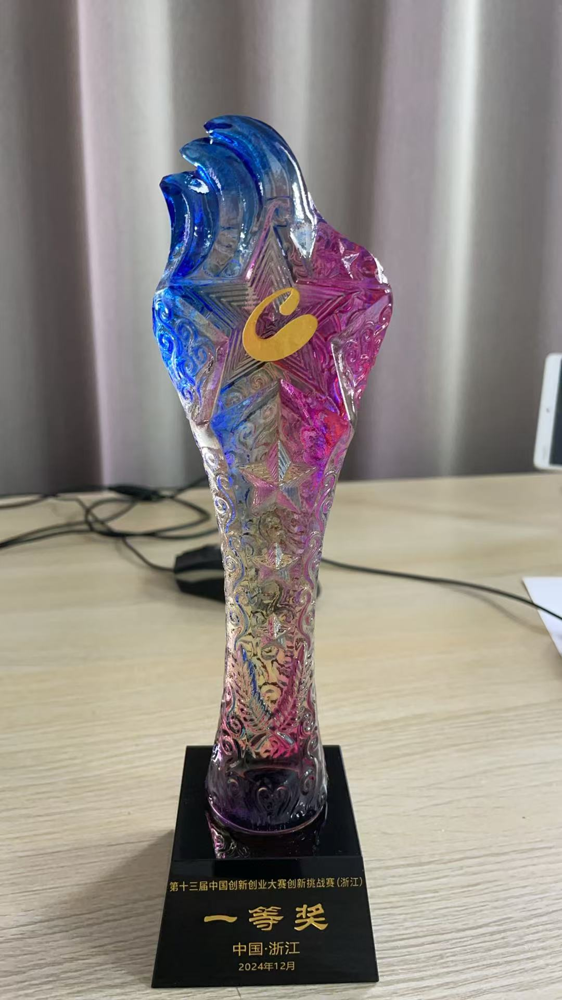
    

    
<strong>2024年 第十三届中国创新创业大赛创新挑战赛（浙江）暨2024年浙江省技术需求“揭榜挂帅”大赛一等奖</strong>

  

  

    

      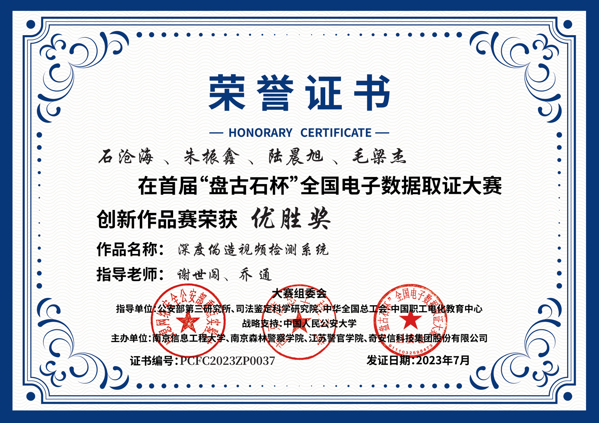
    

    
<strong>2023年 首届“盘古石杯”全国电子数据取证大赛创新作品赛 优胜奖</strong>

  

  

    

      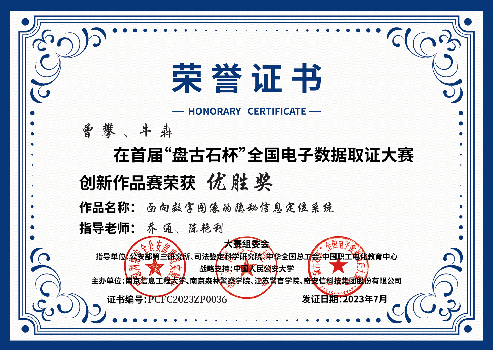
    

    
<strong>2023年 首届“盘古石杯”全国电子数据取证大赛创新作品赛 优胜奖</strong>

  

  

    

      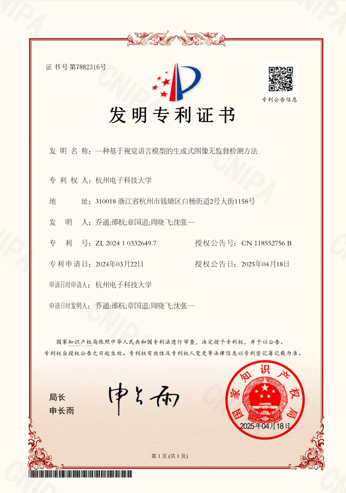
    

    
<strong>发明专利证书 一种基于视觉语言模型的生成式图像无监督检测方法</strong>

  

  

    

      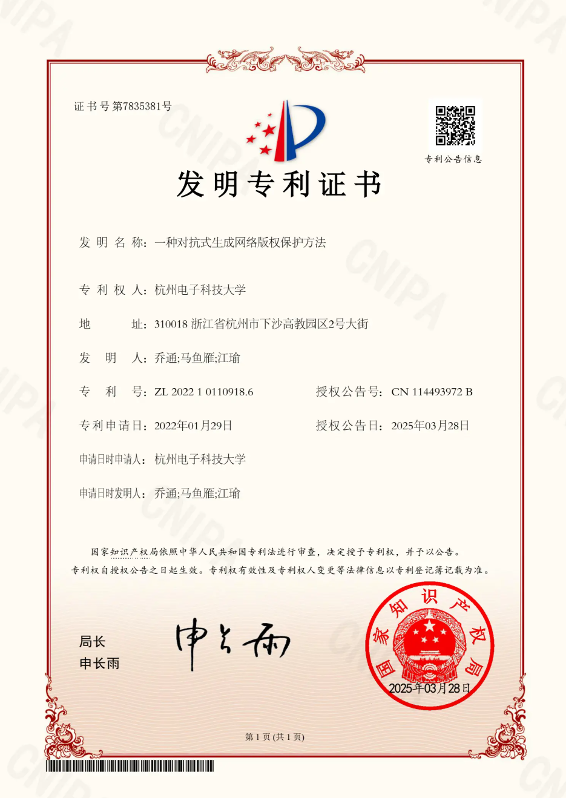
    

    
<strong>发明专利证书 一种对抗式生成网络版权保护方法</strong>

  

  

    

      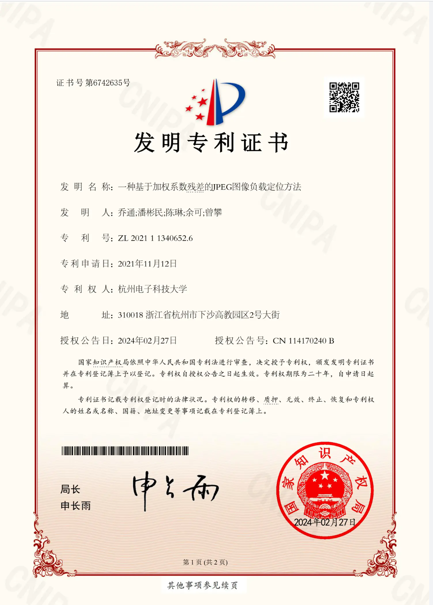
    

    
<strong>发明专利证书 一种基于加权系数残差的JPEG图像负载定位方法</strong>

  

  

    

      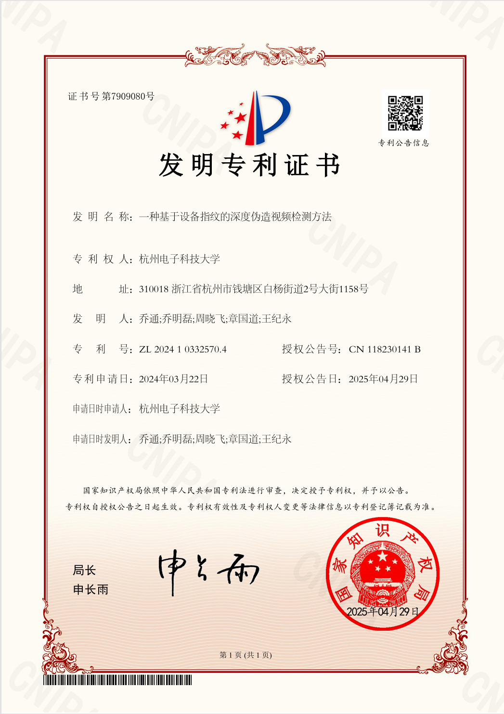
    

    
<strong>发明专利证书 一种基于设备指纹的深度伪造视频检测方法</strong>

  

  

    

      
    

    
<strong>发明专利证书 一种多专家模型联合决策的人工智能伪造内容检测方法</strong>

  

  

    

      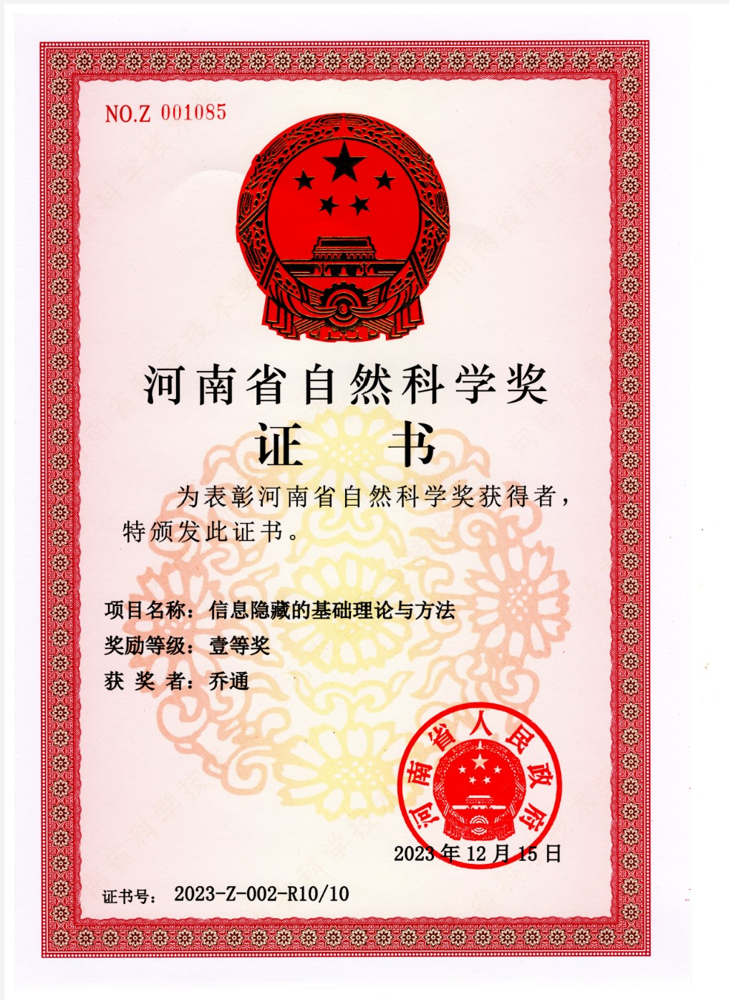
    

    
<strong>2023年 河南省自然科学奖</strong>

  

## 📬 联系我们

若您希望申请试用、获取技术资料或业务合作，请联系：

- 📧 邮箱：`zhuang.li@hdu.edu.cn`   
- 📞 电话：`17366636375`

---

> 👁️‍🗨️ 下一页推荐阅读：[检测能力演示]()

