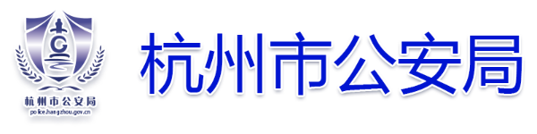

# 🛡️ Anti-Fake AI 产品介绍

> 面向多模态内容伪造检测的全流程解决方案  
> 为安全审查、内容监管、司法取证提供强有力的技术支撑

---

## 🔍 什么是 Anti-Fake AI？

**Anti-Fake AI** 是一款面向图像、视频、音频等多模态内容的**AIGC伪造检测平台**，可自动识别并判断内容是否由主流生成式AI模型（如秒画、文心一格、Midjourney、Runway等）合成。

平台具备以下核心能力：

- 🎯 **高准确率检测**：基于多监督训练 + 鲁棒特征提取，检测精度行业领先  
- ⚡ **低时延响应**：端到端优化设计，检测响应最快可达 20ms  
- 🔎 **内容指纹溯源**：支持AI模型溯源识别、版本识别、伪造局部定位  
- 🧠 **多模态融合**：统一检测图像 / 视频 / 音频 / 文本内容  
- 🔐 **隐私与合规保障**：支持本地私有化部署，满足政企合规要求

---

## 🧭 应用场景

| 场景          | 描述                                                                 |
| ------------- | -------------------------------------------------------------------- |
| 政务审查      | 检测AI伪造图像/视频是否存在于社交媒体、举报材料等                   |
| 媒体内容风控  | 帮助平台识别“虚假人物”、“伪造声明”、“伪造报道”等生成内容         |
| 法律取证      | 在司法流程中定位伪造内容来源、判断是否为AI生成                     |
| 教育内容鉴别  | 在教学/考试材料中判定学生是否使用AI生成图像或论文                   |
| 内容平台审核  | 视频平台对上传内容进行AI检测与可信度评估                           |

---

## 🌐 支持模型类型

平台当前已支持检测以下主流AI内容生成模型：

- 🧊 **商汤 · 秒画**
- 🌸 **百度 · 文心一格**
- 🌀 **Midjourney**
- 🎨 **Runway Gen-2**
- 🧠 **Stable Diffusion系列**
- ✨ **OpenAI · Sora（实验中）**

支持模型数量：**150+**

---

## 📊 产品功能对比表

| 功能项        | Free Plan       | Medium Plan     | Pro Plan        |
| :-----------: | :-------------: | :-------------: | :-------------: |
| 支持模型数    | 92              | 120             | 150+            |
| 检测时延      | 120ms           | 80ms            | 20ms            |
| 图像检测      | ✅               | ✅               | ✅               |
| 视频检测      | ❌              | ✅               | ✅               |
| 音频检测      | ❌              | ❌              | ✅               |
| 多语言支持    | 简体中文        | 中英双语        | 多语种（含API）  |
| 本地私有部署  | ❌              | ✅               | ✅               |
| 模型溯源分析  | ❌              | ✅               | ✅（支持版本识别） |
| 高并发处理    | ❌              | 最高 200 QPS    | 无限扩展        |
| 技术支持      | 社区支持        | 工作日响应      | 专属客服+定制对接 |

---

## 🏆 为什么选择 Anti-Fake AI？

- **权威认可**：产品获得多项AI安全赛事奖项，入选多地公安/网信办采购目录  
- **泛化能力强**：面对未知模型伪造内容，依旧具备较强识别能力  
- **可持续更新**：模型库与检测算法持续升级，跟进最新AIGC发展  
- **可定制服务**：支持政企定制检测策略、UI界面、API格式  

---

<<<<<<< Updated upstream
=======
## 🧪 实验室与平台

  

    
    

      <h3 style="font-size: 1.1rem; line-height: 1.3rem; margin: 0;">浙江-法国数字媒体取证国际联合实验室</h3>
    

    
成立于2023年，专注于AIGC伪造检测技术的研发与应用。

  

  

    
    

      <h3 style="font-size: 1.1rem; line-height: 1.3rem; margin: 0;">深度伪造检测实验室</h3>
    

    
2025年与杭州市公安局刑事科学技术研究所联合成立，聚焦前沿伪造内容识别与司法取证技术。

  

---
## 🤝 合作伙伴

  

    

      
    

    
<strong>杭州市公安局</strong>

  

  

    

      
    

    
<strong>绍兴市公安局</strong>

  

---

## 🏅 荣誉与奖项

  

    

      
    

    
<strong>2024年 全国人工智能应用场景创新挑战赛 全国总决赛特等奖</strong>

  

  

    

      
    

    
<strong>2024年 全国人工智能应用场景创新挑战赛 智能网专项赛特等奖</strong>

  

  

    

      
    

    
<strong>2024年 第十三届中国创新创业大赛创新挑战赛（浙江）暨2024年浙江省技术需求“揭榜挂帅”大赛一等奖</strong>

  

  

    

      
    

    
<strong>2023年 首届“盘古石杯”全国电子数据取证大赛创新作品赛 优胜奖</strong>

  

  

    

      
    

    
<strong>2023年 首届“盘古石杯”全国电子数据取证大赛创新作品赛 优胜奖</strong>

  

  

    

      
    

    
<strong>发明专利证书 一种基于视觉语言模型的生成式图像无监督检测方法</strong>

  

  

    

      
    

    
<strong>发明专利证书 一种基于视觉语言模型的生成式图像无监督检测方法奖</strong>

  

  

    

      
    

    
<strong>发明专利证书 一种基于加权系数残差的JPEG图像负载定位方法</strong>

  

  

    

      
    

    
<strong>2023年 河南省自然科学奖</strong>

  

>>>>>>> Stashed changes
## 📬 联系我们

若您希望申请试用、获取技术资料或业务合作，请联系：

📧 邮箱：`antifakeai@yourdomain.com`  
🌐 官网：`https://yourdomain.com`  
📞 电话：`400-1234-567`

---

> 👁️‍🗨️ 下一页推荐阅读：[检测能力演示]()

